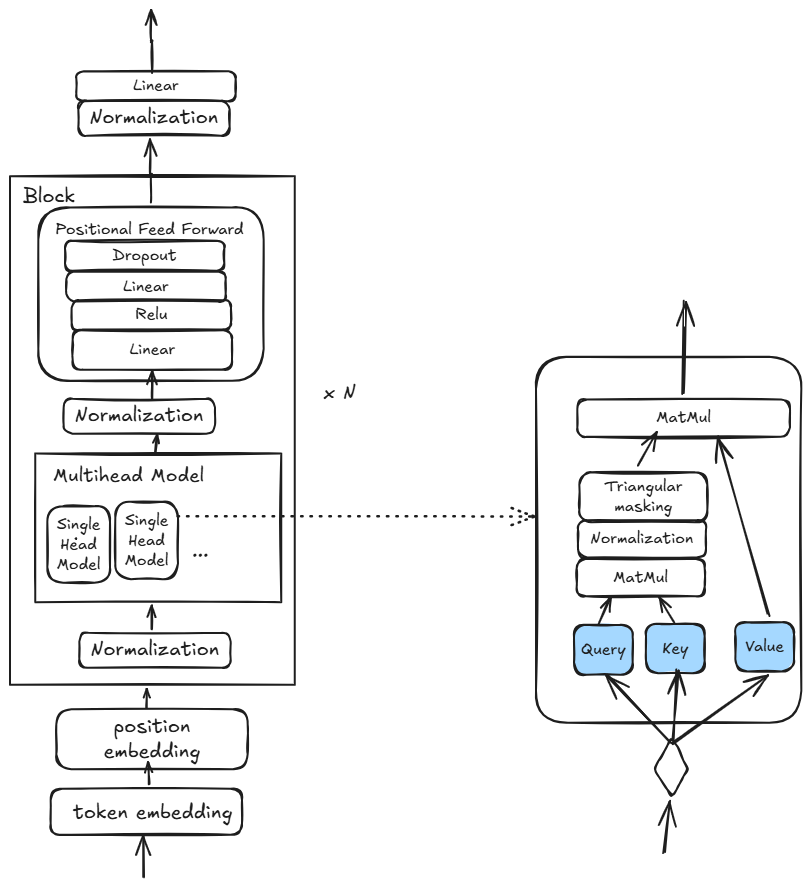

# Another implementation of GPT model from scratch

This is another re-implementation of GPT-2 model, as explained by Andrew Karpathy [here](https://www.youtube.com/watch?v=kCc8FmEb1nY&t=3728s). I am using burn library to implement Machine Learning model.

This is an exercise for educational purposes, because the best way to understand something is to build it. The GPT model itself is implemented in model.rs, tokenizer.rs is a very basic character tokenizer, similar to the one used in the video. A more sofisticated tokenizer is a Byte/Pair encoding BPE tokenizer like the one used in open [GPT2 BPE](https://en.wikipedia.org/wiki/Byte_pair_encoding).
BPE Tokenizer is not used because it will make the model much slow to train with a high vocabulary size.

## What is a GPT?

G: Generative
P: Pre-trained
T: Transformer

A transformer is just another Deep Neural Network Model Architecture for sequence tasks, like language related taks (translation, ...). Another Deep NN to do the same job are Recurrent NN, LSTM, GRU, but transformer architecture is much more sucessfull thanks to self-attention mechanism.

Transformer architecture is explained in [Attention is all you need paper](https://arxiv.org/pdf/1706.03762), but GPT uses only the decoder stack:

This is the architecture of the model implemented in model.rs:



## CLI

```
Usage: gpt2_from_scratch [OPTIONS]

Options:
  -g, --gpu                  Use GPU for training
  -t, --train <TRAIN>        Train the model. If this is not set, the model will be loaded from the model directory
  -m, --model <MODEL>        Directory to save the model and the artifacts [default: ./model/]
      --config <CONFIG>      Path to the config file with hyperparameters of the model architecture [default: ./config.yaml]
      --generate <GENERATE>  Generate a number of tokens
      --context <CONTEXT>    Context for the generation
  -h, --help                 Print help
```

If -g parameter is provided, GPU would be used to train the model, if not only CPU is used (Burn uses NdArray -> similar to numpy in rust as backend).

For training a model on an input file you have to use --train parameter like this:

```
cargo run --quiet --release -- --gpu --train ./gpt2_data/shakespeare.txt -m ./model_shakespeare --config config.yaml
```

Once the model is trained, the weights are saved to directory defined with -m parameter, and can be used in generative phase with --generate parameter with the number of tokens to generate, and optionally providing an initial context:

```
cargo run --quiet --release -- --generate 100 --context "ROMEO: " -m ./model_shakespeare --config config.yaml
```


### Model Hyperparameters

The config file contains the hyperparameters of the model:

| Hyperparameter | Definition |
| ------------- | ----- |
| steps         | Training step  |
| batch_size    | Batch size    |
| n_ctxt        | Number of tokens to look for self attention   |
| learning_rate | usual optimization learning rate|
| n_embd        | Embedding size   |
| n_heads       | Number of parallel heads in Self Attention block     |
| n_layers      | Number of sequential Blocks. Defines the depth of the model     |


## Speaking "shakespearian"

### Training
I trained the model with the following hyperparameters on the [Shakespeare works](https://raw.githubusercontent.com/karpathy/char-rnn/master/data/tinyshakespeare/input.txt).


```
config.yaml
```
| Hyperparameter | Value |
| ------------- | ----- |
| steps         | 1000   |
| batch_size    | 64     |
| n_ctxt        | 256    |
| learning_rate | 0.0003 |
| n_embd        | 384    |
| n_heads       | 6      |
| n_layers      | 6      |

The final loss value was 1.573561668395996 on the train data and 1.7845741510391235 for the validation data, which is similar to the values obtained by Karpathy in his video.

### Generation

After training you can use the saved model checkpoint to generate something resembling old english language:

```
cargo run --quiet --release -- --generate 300 --context "JULIET: "  -m model_shakespeare --config config.yaml
JULIET:
breative,
Slaught nartion the sfod me on the!
Acand dospendate would stand is agaure.

AUFIUl:
You, your.

COROLUS:
What, I shall of hert'd thus the king;
And the givedged of my wonder of your carssue,
Who! that roudle in our mine, that
doubbly Kill
```

## Speaking "tsharkarian"

Training the model above requires a decent GPU to train and not get bored, so I also tried a more simple language model, like tshark output, which is more easy to train.

This is the hyperparameters for training on the tshark file:

```
config_tshark.yaml
```
| Hyperparameter | Value |
| ------------- | ----- |
| steps         | 1000   |
| batch_size    | 64     |
| n_ctxt        | 64    |
| learning_rate | 0.0003 |
| n_embd        | 64    |
| n_heads       | 4      |
| n_layers      | 2      |

Training this in a CPU takes about 5 minutes with a final loss on the training data of 0.5851069688796997 and 0.6582298278808594 on the validation set. 
Generation of text shows that the model captured the format of the tshark output:

cargo run --quiet --release -- --generate 1500  -m m_tshark --config config_tshark.yaml

``` 
1425839 8.232617    10.208.1.1  8=01.201.63.12  10.208.1.1   GTP <HTTP> 1436 [TCP Spurious Retrin=7994679 TS?TSecr=18855988
43145  26.14862   10.208.1.1  88.201.1.1   HTTP 1400 Continuation
12402  26.7192885 8.201.63.12  10.208.1.1   GTP <TCP> 1436 [TCP Out-Of-Order] 80  4930 [ACK] Seq=100 Ack=32033 Win=40 Len=1348 TSval=2591113 TSecr=189
13717
440238  21.449750 88.201 8.201.63.1tTCP 52 49936 [ACK] Seq=1302706 Ack=3220 Win=79999588 Len=0 TSval=188891 TSecr=259113271
243274  2.2650540    10.201.63.12  10.208.1.1   GTP <TCP> 1436 [TCP Retranssmransssion] 80  49930 [Ack=445677 Ack=405040 Win=79940 Len=1348 TSLecr=188
44036 TSpu=25911422 TSval=1888349 TSecr=259111 TSecr=259113827 TSecr=18885136
23720  2.7247264  10.21.63.12  10.208.1.1   HTTP 14036 [TCP Spurious Retransmision] Continuation
13672  2.457241 88.201.63.12  10.208.1.1   GTP <HTTTP> 1436 [TCP [TCP Out-Of-Or] 80 494 [ACK] Seq=193 Ack=22550 Win=449948 Len=0 TSval=259111 TSecr=25
9111369277
4076  26.32969453 8.3.1201.63.12  10.208.1.1   GTP <HTTP> 1436 [TCP Spurious Retranssssion] Continuation
824597  32.0586764   10.208.1.1  808.201.63.12 TCP 52 49936  [ACK] Seq=2693913 Ack=321783 Win=0320 Len=1348 Tr=1889740
404928  31.0358632   10.208.1.1  88.201.63.12 TCP 52 4994 8.201.63  10.208.1.1  88.201.63.12 TCP 52 49936  80 [ACK] Seq=84179701 Ack=320 Win=484032 Le
n=1348 TSval=2591Win=2796093 Len=0 TSval=1888998 TSecr=25911137236 TSecr=25925692Secr=267273
24600571  27.168260
```